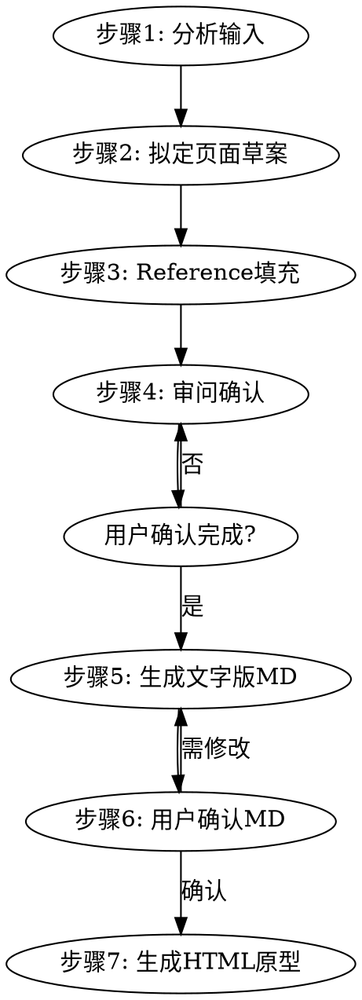

# 0-1项目文字版原型生成器

## 概述

将用户的页面需求从零转化为结构化文字版原型（MD确认稿），用户确认后自动转为 HTML 原型。适用于**没有现有页面参照**的新项目。每个页面包含**页面概览、布局结构、组件明细、状态描述、用户操作**五个部分，支持 Web 和移动端双平台。

**核心原则：** 先用文字版 MD 对齐结构，确认无误后再转 HTML，避免直接画 HTML 后发现结构错误而返工。

## 何时使用

- 新项目需要从零设计页面布局
- 需要快速生成页面布局原型，用于早期设计沟通
- 需要验证 PRD 中的功能点是否有对应 UI 落地
- 需要为开发人员提供页面结构和交互参考
- 需要在视觉设计前给业务方确认页面结构
- 需要描述页面的多种状态（空/加载/错误/成功 + 业务状态变体）
- 需要梳理多页面之间的跳转流程

## 不适用场景

- 需要在现有页面上做迭代修改（请使用 `text-prototype-iteration` skill）
- 需要高保真视觉设计稿（请使用 Figma/Sketch）
- 需要跳过文字确认直接生成 HTML 原型（请使用 `html-prototype-creator` skill）
- 需要像素级精确的布局尺寸

## 工作流程



### 步骤1：分析输入

根据用户提供的输入类型进行分析：

- **自然语言描述：** 提取页面名称、核心功能、平台类型
- **PRD/需求文档：** 逐节扫描，提取所有涉及的页面和功能点
- **功能列表：** 将功能点归类到对应的页面

### 步骤2：拟定页面草案

基于步骤1的分析结果，拟定一份页面草案（不生成文件）：

- 判断是单页面还是多页面
- 多页面时，拟定页面间的跳转关系
- 为每个页面拟定平台（Web/移动端）
- 为每个页面拟定用途说明、入口路径、出口路径
- 为每个页面拟定功能范围（包含什么、不包含什么）
- 为每个页面拟定展示粒度（标题级/关键元素级/完整级）
- 如果用户未指定平台，根据描述推断
- 为每个页面识别类型，准备匹配 `reference/templates/` 中对应参考文档

### 步骤3：Reference 填充

**检查 `reference/templates/` 目录中是否存在该页面类型的布局模板。**

#### 判断逻辑

| 条件 | 动作 |
|------|------|
| 用户提供截图 + templates/ 无对应模板 | 调用框架图prompt生成框线图 → 写入 templates/ |
| 用户提供截图 + templates/ 有对应模板 | 跳过，直接复用 |
| 用户未提供截图 + templates/ 无对应模板 | 提示用户提供截图，或从描述推断布局后生成 |
| 用户未提供截图 + templates/ 有对应模板 | 跳过，直接复用 |

#### 模板不存在时的填充流程

1. 将用户提供的截图和页面名称填入框架图提示词（通用版）的变量部分
2. 执行提示词，生成 ASCII 框线图
3. 将框线图写入 `reference/templates/<页面类型>.md`
4. 更新 `reference/templates/_index.md` 中的模板清单

**框架图提示词调用方式：**

```
# 角色
你是专业的 UI 结构分析师，擅长把移动端页面截图抽象成"模块布局框架图"（ASCII 框线图）。

# 任务
请为下方提供的每张截图绘制一张模块布局框架图。

# 本次输入
- 截图列表：
  1. [页面名] —— [截图]

# 工作步骤
## 第1步：逐图识别模块（从上到下扫描，记录模块名称、层级关系、子区域结构）
## 第2步：绘制框架图（ASCII 框线字符 ┌─┐│└┘├┤┬┴┼，并列子模块用左右分栏，重复元素用 *数字）
## 第3步：输出（每张截图一个独立区块，只输出框架图）

# 约束
1. 只画结构骨架——模块名+层级+顺序
2. 模块名称必须与截图中的实际标题文字一致
3. 框线整体宽度统一，竖线垂直对齐
```

#### 模板就绪后

所有涉及的页面类型都有模板后，进入步骤4。后续步骤5生成原型时，布局结构部分直接引用对应模板。

### 步骤4：审问确认（强制步骤，不可跳过）

**在生成任何原型文件之前，必须调用 `grill-with-docs` skill 对用户进行审问式访谈。**

**调用方式：** 使用 Skill 工具调用 `grill-with-docs`。

**审问目标：** 让用户确认、补充或修正页面清单和每个页面的关键信息，而不是让用户自己思考。

**审问内容必须覆盖以下8个维度：**

1. **页面清单确认：** 将拟定的页面草案展示给用户，询问是否需要增减页面
2. **平台确认：** 确认每个页面的平台（Web/移动端）是否正确
3. **页面用途确认：** 确认每个页面的用途说明是否准确
4. **跳转关系确认：** 确认页面间的入口路径和出口路径是否完整
5. **关键组件确认：** 询问每个页面是否有关键组件需要特别说明
6. **功能范围边界确认：** 确认"包含"和"不包含"的功能点是否准确，防止范围蔓延
7. **展示粒度确认：** 确认每个页面展开到什么程度（标题级/关键元素级/完整级）
8. **遗漏检查：** 追问是否有遗漏的页面或功能点

**审问规则：**

- 每轮提问提供选项让用户选择，不让用户自由思考
- 一次只问一个维度的问题，避免信息过载
- 根据用户的回答动态调整后续问题
- 审问持续到用户确认页面草案无误为止
- 如果用户在原始需求中已明确某个维度，跳过该维度
- 审问完成后，将最终确认的页面清单整理为正式页面清单

**审问完成后输出确认清单：**

```
## 页面清单确认
以下页面清单已与用户确认，将用于生成原型文件：

| 序号 | 页面名称 | 平台 | 用途 | 展示粒度 | 功能范围 | 入口 | 出口 |
|------|---------|------|------|---------|---------|------|------|
| 1 | [名称] | [平台] | [用途] | [粒度] | [范围] | [入口] | [出口] |
| 2 | [名称] | [平台] | [用途] | [粒度] | [范围] | [入口] | [出口] |
```

### 步骤5：生成文字版原型 MD

基于步骤4用户确认后的页面清单，为每个页面生成一个 Markdown 文件。**布局结构部分直接引用步骤3填充的 reference 模板。**

多页面时，额外生成 `index.md` 索引文件，统领所有页面。

**文件命名规则：** `平台-页面名.md`

示例：
- `web-login-page.md`
- `mobile-home-page.md`
- `web-dashboard-page.md`

### 步骤6：用户确认 MD

展示生成的 MD 文件内容，请用户确认结构无误：

- A. 确认无误，生成 HTML 原型 ← 推荐
- B. 需要修改布局结构
- C. 需要修改组件明细
- D. 需要修改状态描述
- E. 其他（请说明）

**用户确认通过后，进入步骤7。用户要求修改时，回到步骤5调整后重新确认。**

**此步骤的意义：** MD 是"确认稿"，让用户在看到 HTML 之前先确认页面结构、组件、状态、操作是否正确。结构层面的错误在 MD 阶段修改成本极低，到 HTML 阶段再改则成本高。

### 步骤7：生成 HTML 原型

**调用 `html-prototype-creator` skill**，将确认后的 MD 文件转化为 HTML 原型。

**MD → HTML 映射关系：**

| MD 部分 | 映射到 HTML |
|---------|------------|
| 布局结构（框线图） | HTML 的模块结构（div 层级） |
| 组件明细（八字段） | HTML 的具体元素（button/input/card 等） |
| 状态描述 | HTML 的状态切换交互（JS 控制） |
| 用户操作 | HTML 的事件绑定（click/scroll 等） |

生成后：
1. 用 `computer://` 链接分享 HTML 文件
2. 简要说明原型包含哪些模块和交互
3. 主动询问是否需要调整

## 参考文档（reference）

skill 内置 `reference/templates/` 目录，提供成熟页面的布局骨架供复用。

**使用规则：**

1. 步骤2 拟定页面草案后，根据页面清单识别每个页面的类型
2. 步骤3 检查 templates/ 是否有对应模板，没有则调用框架图prompt生成
3. 步骤5 生成原型时，布局结构部分直接引用对应模板
4. 生成时：参考文档的骨架作为基础，具体文案和数据需结合用户场景调整

## 页面原型结构

每个页面文件**必须**包含以下五个部分，缺一不可。

### 一、页面概览（七要素）

描述页面的基本身份信息和范围边界：

```
## 页面概览
- 页面名称：[页面名称]
- 用途说明：[一句话描述页面用途]
- 所属平台：[Web / 移动端]
- 入口路径：[从哪些页面可以进入此页面]
- 出口路径：[此页面可以跳转到哪些页面]
- 功能范围：[本次原型包含哪些功能点]
- 不包含：[明确排除的功能点，防止范围蔓延]
- 展示粒度：[标题级 / 关键元素级 / 完整级]
```

**功能范围边界说明：**
- **功能范围：** 明确列出本页面包含的功能点，如"商品展示、搜索、加入购物车"
- **不包含：** 明确排除的功能点，如"不含支付流程、不含订单管理"
- 这两个字段防止开发时范围蔓延，也让审阅者快速判断原型是否覆盖需求

**展示粒度说明：**

| 粒度级别 | 含义 | 适用场景 |
|---------|------|---------|
| 标题级 | 只画模块标题+占位 | 概览沟通、早期对齐 |
| 关键元素级 | 画出按钮、卡片、列表项等关键子元素 | 需求评审、开发参考（推荐） |
| 完整级 | 完整还原所有细节 | 交付级、含异常态和边界情况 |

### 二、布局结构

引用 `reference/templates/<页面类型>.md` 中的布局骨架，用 Unicode 框线字符绘制页面的区域划分和嵌套关系：

```
## 布局结构

┌──────────────────────────────────────────┐
│ 顶部区域                                  │
│   Logo              导航菜单              │
├──────────────────────────────────────────┤
│ 主体内容区                                │
│ ┌────────────┐  ┌──────────────────────┐ │
│ │ 左侧边栏   │  │ 右侧内容区           │ │
│ │            │  │ ┌──────────────────┐ │ │
│ │            │  │ │ 搜索栏           │ │ │
│ │            │  │ └──────────────────┘ │ │
│ │            │  │ ┌──────────────────┐ │ │
│ │            │  │ │ 数据列表         │ │ │
│ │            │  │ └──────────────────┘ │ │
│ └────────────┘  └──────────────────────┘ │
├──────────────────────────────────────────┤
│ 底部区域                                  │
│   版权信息                                │
└──────────────────────────────────────────┘
```

**Unicode 框线字符参考：**

| 字符 | 用途 |
|------|------|
| ┌ ┐ └ ┘ | 四角 |
| ├ ┤ ┬ ┴ ┼ | T型连接、十字连接 |
| │ ─ | 竖线、横线 |

**绘制规范：**

- 每个区域用方框包围，嵌套区域在父区域内画子方框
- 同级区域并排放置，用空格分隔
- 区域名称写在方框顶部或内部第一行
- 需在等宽字体环境下查看（中文字符占2个英文字符宽度）

### 三、组件明细（八字段）

对布局结构中的每个组件，描述**八个字段**：

```
## 组件明细

### 组件1：[组件名称]
- 类型：[按钮/输入框/下拉选择/表格/卡片/弹窗/Tab栏...]
- 占位文案：[显示的示例文字]
- 所在区域：[属于布局结构中的哪个区域]
- 尺寸说明：[宽度/高度/占比描述]
- 交互行为：[点击/悬停/输入时的行为]
- 数据来源：[数据从哪里来]
- 约束条件：[字数限制/必填/格式要求等]
- 内部结构：[自定义组件的内部构成；标准组件写"无"]
```

**八个字段必须全部填写。** 如果某字段不适用，写"无"并简要说明原因。

**字段填写规则：**

| 字段 | 填写方式 |
|------|---------|
| 类型、占位文案、交互行为、数据来源、约束条件 | 从 component-library.md 取对应组件的填写指引 |
| 所在区域 | 根据页面背景、场景信息和布局结构树智能判断，需与布局树节点名一字不差 |
| 尺寸说明 | 根据平台规范和组件类型推断（移动端按钮高度40-48px、卡片宽度按屏幕占比等） |
| 内部结构 | 标准组件写"无"；自定义组件描述内部由哪些子元素构成 |

### 四、状态描述（技术状态 + 业务状态）

描述页面在不同状态下的变化，分两层：

```
## 状态描述

### 技术状态

#### 空状态
- [此状态下各区域显示什么内容]

#### 加载中
- [此状态下各区域显示什么内容]

#### 错误状态
- [此状态下各区域显示什么内容]

#### 成功状态（有数据）
- [此状态下各区域显示什么内容]

### 业务状态变体

根据页面业务场景，列出影响页面内容变化的业务状态：

#### [业务状态1，如：未登录用户]
- [哪些模块隐藏/显示/变化]

#### [业务状态2，如：已登录普通用户]
- [哪些模块隐藏/显示/变化]

#### [业务状态3，如：已登录会员用户]
- [哪些模块隐藏/显示/变化]
```

**业务状态变体说明：**
- 并非所有页面都有业务状态变体，没有时写"本页面无业务状态变体"
- 常见业务状态：登录/未登录、用户等级（普通/会员/VIP）、首次进入/已操作过、有优惠券/无优惠券
- 业务状态变体的作用是明确"同一个页面，不同用户看到什么不同内容"

### 五、用户操作

描述此页面上用户的所有操作路径：

```
## 用户操作
- 点击[组件A] → [触发什么] → [跳转到哪里 / 显示什么]
- 点击[组件B] → [触发什么] → [跳转到哪里 / 显示什么]
- 输入[组件C] → [触发什么] → [显示什么]
- 滑动[区域D] → [触发什么] → [加载什么]
```

**操作路径必须完整：** 触发动作 → 中间过程 → 最终结果（跳转/显示/变更），不可只写"点击跳转"。

## 索引文件格式

多页面时生成 `index.md`：

```
# 原型索引

## 项目信息
- 项目名称：[名称]
- 生成时间：[日期]
- 项目类型：0-1 新建
- 平台：[Web / 移动端 / 双平台]
- 页面总数：[数量]

## 页面清单

| 序号 | 页面名称 | 文件 | 平台 | 粒度 | 入口 | 出口 |
|------|---------|------|------|------|------|------|
| 1 | 登录页 | web-login-page.md | Web | 关键元素级 | 直接访问 | 首页、找回密码页、注册页 |
| 2 | 首页 | web-home-page.md | Web | 关键元素级 | 登录页 | 个人中心、设置页 |

## 页面跳转关系
登录页 → 首页 → 个人中心
                  → 设置页
注册页 → 登录页
```

## 标准组件库

内置 Web 和移动端标准组件库，包含组件类型、典型用法和字段填写指引。

**详细组件清单见：** [component-library.md](component-library.md)

### Web 组件（30+）

按钮、输入框、文本域、下拉选择、单选框、复选框、开关、日期选择器、滑块、表格、分页器、标签页、面包屑、导航菜单、侧边栏、卡片、弹窗、抽屉、提示框、通知、标签、徽标、进度条、上传、搜索框、排序、筛选器、树形控件、步骤条、时间线、折叠面板

### 移动端组件

状态栏、导航栏、Tab栏、列表项、卡片、按钮、输入框、搜索栏、轮播图、网格宫格、底部弹窗、操作菜单、标签、徽标、进度条、骨架屏、空状态、下拉刷新、上拉加载

## 输出要求

1. **语言：** 所有输出内容统一使用中文
2. **文件格式：** 先输出 `.md`（确认稿），确认后输出 `.html`（交付物）
3. **MD 文件命名：** `平台-页面名.md`（如 `web-login-page.md`、`mobile-home-page.md`）
4. **HTML 文件命名：** `[页面名]原型.html`（如 `登录页原型.html`）
5. **保存位置：** 用户工作目录
6. **单页面：** 一个 MD + 一个 HTML
7. **多页面：** 所有页面 MD + `index.md` 索引 + 所有页面 HTML

## 常见错误

| 错误 | 正确做法 |
|------|---------|
| 跳过步骤3 Reference填充直接审问 | 必须先确保模板就绪，审问时才有布局参照 |
| 跳过审问直接生成文件 | 必须在生成文件前调用 grill-with-docs 与用户确认页面清单 |
| 跳过步骤6用户确认直接生成HTML | 必须让用户确认MD结构无误后再转HTML |
| 只描述静态布局，忽略状态变化 | 必须包含技术四态 + 业务状态变体 |
| 组件描述过于笼统，缺少交互和数据来源 | 每个组件必须填满八个字段 |
| 文件命名不含平台前缀 | MD文件名必须以 `web-` 或 `mobile-` 开头 |
| 多页面时不生成索引文件 | 多页面必须生成 index.md |
| 用户操作只写"点击跳转" | 必须写明完整操作路径和跳转目标 |
| 框线图未对齐或字符连接错误 | 框线字符必须正确连接，确保等宽字体下对齐 |
| 组件字段写"暂无"或留空 | 不适用时写"无"并说明原因 |
| 审问时让用户自由思考而非提供选项 | 每轮提问必须提供选项供用户选择 |
| 所在区域与布局树节点名不一致 | 所在区域必须与布局结构树中的区域节点名一字不差 |
| 功能范围模糊 | 必须明确"包含"和"不包含"，防止范围蔓延 |
| 展示粒度未声明 | 必须在页面概览中声明粒度级别 |
| 业务状态变体遗漏 | 必须检查是否有影响页面内容的业务状态（登录态、用户等级等） |
| Reference模板已存在仍重复生成 | 模板存在时直接复用，不重复调用框架图prompt |

## 快速参考

| 项目 | 规范 |
|------|------|
| 项目类型 | 0-1 新建（无现有页面参照） |
| 输入类型 | 自然语言 / PRD / 功能列表（自适应） |
| 输出格式 | 先 MD（确认稿）→ 确认后 HTML（交付物） |
| 平台 | Web + 移动端 |
| MD 文件命名 | `平台-页面名.md` |
| HTML 文件命名 | `[页面名]原型.html` |
| 页面结构 | 概览+布局+组件+状态+操作（五部分缺一不可） |
| 页面概览 | 七要素（含功能范围、不包含、展示粒度） |
| 组件字段 | 名称+类型+文案+区域+尺寸+交互+数据+约束+内部结构（八字段） |
| 状态种类 | 技术4态（空/加载/错误/成功）+ 业务状态变体 |
| 多页面 | 生成 index.md 索引 |
| 审问步骤 | 步骤4，生成文件前必须调用 grill-with-docs 确认8个维度 |
| Reference填充 | 步骤3，模板不存在时调用框架图prompt生成 |
| HTML生成 | 步骤7，用户确认MD后调用 html-prototype-creator |
| 参考文档 | 生成前读取 reference/templates/ 对应文件，复用布局骨架 |
| 输出语言 | 中文 |

## 与其他 skill 的协作

| 场景 | 调用的 skill |
|------|-------------|
| Reference 模板不存在，需从截图生成框线图 | 框架图提示词（通用版） |
| 审问确认页面清单 | `grill-with-docs` |
| 用户确认 MD 后生成 HTML 原型 | `html-prototype-creator` |
