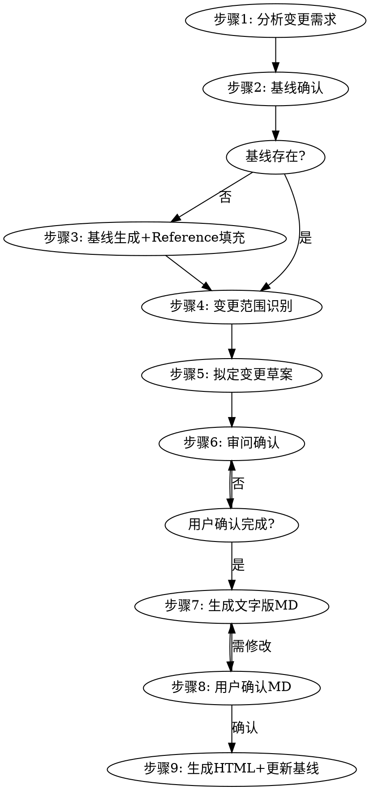

# 迭代项目文字版原型生成器

## 概述

将用户的迭代需求转化为结构化文字版原型（MD确认稿），用户确认后自动转为 HTML 原型。适用于**有现有页面参照**的迭代项目，核心能力是**识别现状、描述差异、对照变更**。每个页面包含**页面概览、布局结构、组件明细、状态描述、用户操作、变更对照**六个部分，支持 Web 和移动端双平台。

**核心原则：** 基于现状做增量描述，不重新发明轮子。只对变更部分展开详述，不变部分仅列名称。先用 MD 对齐变更结构，确认后再转 HTML。

## 何时使用

- 在现有页面上新增模块或功能
- 修改现有页面的模块结构或交互
- 删除或移除现有页面中的模块
- 优化现有页面的布局或用户体验
- 需要描述"改了什么"并对照"变更前后"
- 需要基于现有页面状态做增量需求文档

## 不适用场景

- 从零新建页面，无现有页面参照（请使用 `text-prototype-from-scratch` skill）
- 需要高保真视觉设计稿（请使用 Figma/Sketch）
- 需要跳过文字确认直接生成 HTML 原型（请使用 `html-prototype-creator` skill）
- 需要像素级精确的布局尺寸

## 核心概念

### 变更类型标记

迭代项目的核心是标识每个模块/组件的变更类型：

| 标记 | 含义 | 描述要求 |
|------|------|---------|
| `[新增]` | 本次迭代新增的模块/组件 | 完整描述（同0-1项目标准） |
| `[修改]` | 在现有基础上调整的模块/组件 | 描述变更内容 + 变更前对照 |
| `[删除]` | 本次移除的模块/组件 | 仅列名称 + 删除原因 |
| `[不变]` | 维持现状的模块/组件 | 仅列名称，不展开 |

### 基线（Baseline）

基线是项目现有页面的状态快照，是迭代项目的参照基准：

- 存放在 `reference/baseline/` 目录
- 文件命名：`<页面名>-v<版本号>.md`（如 `home-v1.0.md`）
- 基线不是手写的，而是用 `text-prototype-from-scratch` skill 生成的
- 每次迭代完成后，新版状态存为新基线（版本号递增）

## 工作流程



### 步骤1：分析变更需求

根据用户提供的输入，提取变更信息：

- **改哪个页面：** 识别涉及的现有页面
- **改什么：** 新增/修改/删除哪些模块或功能
- **改成什么样：** 目标状态描述
- **为什么改：** 变更动机（可选，但有助于验证变更合理性）

**输入类型处理：**

| 输入类型 | 处理方式 |
|---------|---------|
| 需求文档 | 提取变更点清单，逐条对应到页面和模块 |
| 截图+描述 | 从截图中识别现有结构，从描述中提取变更意图 |
| 自然语言描述 | 提取"改哪个页面、改什么、改成什么" |
| 现有原型+修改意见 | 读取现有原型，定位修改区域 |

### 步骤2：基线确认

**检查 `reference/baseline/` 目录中是否存在该页面的基线快照。**

#### 情况A：基线已存在

直接引用基线文件，记录基线版本号和快照时间，进入步骤4。

#### 情况B：基线不存在

进入步骤3，生成基线。

### 步骤3：基线生成 + Reference 填充（基线不存在时执行）

此步骤完成两件事：填充 Reference 模板 + 生成基线快照。

#### 3a. Reference 模板填充

**检查 `reference/templates/` 目录中是否存在该页面类型的布局模板。**

| 条件 | 动作 |
|------|------|
| 用户提供截图 + templates/ 无对应模板 | 调用框架图prompt生成框线图 → 写入 templates/ |
| 用户提供截图 + templates/ 有对应模板 | 跳过，直接复用 |
| 用户未提供截图 + templates/ 无对应模板 | 提示用户提供截图，或从描述推断布局后生成 |
| 用户未提供截图 + templates/ 有对应模板 | 跳过，直接复用 |

**模板不存在时的填充流程：**

1. 将用户提供的截图和页面名称填入框架图提示词（通用版）的变量部分
2. 执行提示词，生成 ASCII 框线图
3. 将框线图写入 `reference/templates/<页面类型>.md`
4. 更新 `reference/templates/_index.md` 中的模板清单

**框架图提示词调用方式：**

```
# 角色
你是专业的 UI 结构分析师，擅长把移动端页面截图抽象成"模块布局框架图"（ASCII 框线图）。

# 任务
请为下方提供的每张截图绘制一张模块布局框架图。

# 本次输入
- 截图列表：
  1. [页面名] —— [截图]

# 工作步骤
## 第1步：逐图识别模块（从上到下扫描，记录模块名称、层级关系、子区域结构）
## 第2步：绘制框架图（ASCII 框线字符 ┌─┐│└┘├┤┬┴┼，并列子模块用左右分栏，重复元素用 *数字）
## 第3步：输出（每张截图一个独立区块，只输出框架图）

# 约束
1. 只画结构骨架——模块名+层级+顺序
2. 模块名称必须与截图中的实际标题文字一致
3. 框线整体宽度统一，竖线垂直对齐
```

#### 3b. 生成基线快照

调用 `text-prototype-from-scratch` skill，对当前页面生成完整的文字版原型（5部分），存入 `reference/baseline/<页面名>-v1.0.md`。

#### 3c. 向用户确认基线

```
## 基线确认
已建立/引用以下基线：

| 页面 | 基线文件 | 版本 | 快照时间 |
|------|---------|------|---------|
| 首页 | reference/baseline/home-v1.0.md | v1.0 | 2026-08-02 |

基线内容是否准确反映当前页面状态？
- A. 准确，以此为基础进行变更 ← 推荐
- B. 基线有遗漏，需要补充
- C. 基线不准确，需要修正
```

### 步骤4：变更范围识别（核心步骤）

对照基线，逐模块分析变更：

```
## 变更范围识别

对照基线 [home-v1.0.md]，本次迭代变更如下：

| 序号 | 模块名称 | 变更类型 | 变更说明 |
|------|---------|---------|---------|
| 1 | 搜索栏 | [不变] | 维持现状 |
| 2 | Banner轮播 | [修改] | 新增自动播放间隔配置 |
| 3 | 超值券包 | [修改] | 3张券改2张，合并为入会礼+月享券 |
| 4 | 新人专区 | [新增] | 首页新增新人专享模块 |
| 5 | 限时秒杀 | [删除] | 移除秒杀模块，流量导向券包 |
| 6 | 底部导航 | [不变] | 维持现状 |
```

**识别规则：**
- 必须覆盖基线中的所有模块，不可遗漏
- 每个模块必须标记变更类型，不可空缺
- `[删除]` 模块必须注明删除原因
- `[修改]` 模块必须简述变更内容（详细描述在步骤7）

### 步骤5：拟定变更草案

仅对 `[新增]` 和 `[修改]` 部分展开详细描述：

- `[新增]` 模块：按0-1项目标准完整描述（布局+组件+状态+操作）
- `[修改]` 模块：描述变更后的目标状态 + 变更前的对照
- `[删除]` 模块：仅列名称和删除原因
- `[不变]` 模块：仅列名称

### 步骤6：审问确认（强制步骤，不可跳过）

**在生成任何原型文件之前，必须调用 `grill-with-docs` skill 对用户进行审问式访谈。**

**调用方式：** 使用 Skill 工具调用 `grill-with-docs`。

**审问内容必须覆盖以下9个维度：**

1. **基线确认：** 确认引用的基线版本是否正确，是否反映当前状态
2. **变更清单确认：** 将步骤4的变更清单展示给用户，确认是否遗漏
3. **变更类型标记确认：** 确认每个模块的 [新增]/[修改]/[删除]/[不变] 标记是否准确
4. **变更范围边界确认：** 确认"改什么"和"不改什么"的边界
5. **关键变更细节确认：** 对 [修改] 模块，确认变更细节是否准确
6. **新增模块完整性确认：** 对 [新增] 模块，确认是否有遗漏的组件或交互
7. **业务状态影响确认：** 确认变更是否影响业务状态变体（如新增模块在未登录时是否显示）
8. **展示粒度确认：** 确认变更部分展开到什么程度
9. **删除影响确认：** 确认删除模块是否影响其他模块的交互或跳转

**审问规则：**

- 每轮提问提供选项让用户选择，不让用户自由思考
- 一次只问一个维度的问题，避免信息过载
- 根据用户的回答动态调整后续问题
- 审问持续到用户确认变更方案无误为止
- 特别关注删除模块的连锁影响（是否有其他页面/模块引用了被删模块）

**审问完成后输出确认清单：**

```
## 变更方案确认
以下变更方案已与用户确认，将用于生成原型文件：

| 序号 | 页面 | 基线版本 | 变更模块数 | 新增 | 修改 | 删除 | 不变 |
|------|------|---------|-----------|------|------|------|------|
| 1 | 首页 | v1.0 | 6 | 1 | 2 | 1 | 2 |
```

### 步骤7：生成文字版原型 MD

基于步骤6用户确认后的变更方案，为每个页面生成一个 Markdown 文件。**布局结构部分引用 reference 模板并标注变更类型。**

多页面时，额外生成 `index.md` 索引文件。

**文件命名规则：** `平台-页面名-v<新版本号>.md`

示例：
- `mobile-home-page-v1.1.md`（首页 v1.1，基于 v1.0 迭代）
- `web-dashboard-page-v2.0.md`（仪表盘 v2.0，大版本升级）

### 步骤8：用户确认 MD

展示生成的 MD 文件内容（含变更对照），请用户确认无误：

- A. 确认无误，生成 HTML 原型 ← 推荐
- B. 需要修改布局结构
- C. 需要修改组件明细
- D. 需要修改变更对照
- E. 其他（请说明）

**用户确认通过后，进入步骤9。用户要求修改时，回到步骤7调整后重新确认。**

**此步骤的意义：** MD 是"确认稿"，让用户在看到 HTML 之前先确认变更结构、组件、状态、操作、变更对照是否正确。变更层面的错误在 MD 阶段修改成本极低。

### 步骤9：生成 HTML 原型 + 更新基线

#### 9a. 生成 HTML 原型

**调用 `html-prototype-creator` skill**，将确认后的 MD 文件转化为 HTML 原型。

**MD → HTML 映射关系：**

| MD 部分 | 映射到 HTML |
|---------|------------|
| 布局结构（框线图+变更标记） | HTML 的模块结构，[新增]/[修改] 模块可加视觉标注 |
| 组件明细（八字段，仅变更部分） | HTML 的具体元素 |
| 状态描述 | HTML 的状态切换交互 |
| 用户操作（仅变更部分） | HTML 的事件绑定 |
| 变更对照 | HTML 中可加变更标注层（hover 显示变更前状态） |

生成后：
1. 用 `computer://` 链接分享 HTML 文件
2. 简要说明原型包含哪些变更
3. 主动询问是否需要调整

#### 9b. 更新基线

迭代完成后，将新版状态存为新基线：

1. 将生成的 MD 原型文件复制到 `reference/baseline/` 目录
2. 文件名版本号递增：`<页面名>-v<新版本号>.md`
3. 更新 `reference/baseline/_index.md` 中的版本记录

**基线版本管理规则：**
- 小版本（v1.0 → v1.1）：模块内部调整、文案修改、交互优化
- 大版本（v1.x → v2.0）：新增/删除模块、页面结构重组
- 基线保留历史版本，不覆盖旧版本（便于追溯）

## 参考文档（reference）

skill 内置两个 reference 目录：

### reference/templates/（通用模板层）

提供成熟页面的布局骨架，用于步骤3a 生成基线时复用。

**使用规则：**
1. 步骤3a 检查 templates/ 是否有对应模板
2. 模板不存在时，调用框架图prompt从截图生成
3. 模板存在时，直接复用

### reference/baseline/（项目基线层）

存放项目自己页面的当前状态快照，是迭代项目的参照基准。

**目录结构：**

```
reference/baseline/
├── _index.md           # 基线清单：页面/版本号/快照时间/变更摘要
├── home-v1.0.md        # 首页 v1.0 快照
├── home-v1.1.md        # 首页 v1.1 快照（第一次迭代后）
├── member-center-v1.0.md
└── ...
```

**_index.md 格式：**

```
# 基线清单

| 页面 | 当前版本 | 快照时间 | 变更摘要 |
|------|---------|---------|---------|
| 首页 | v1.1 | 2026-08-02 | 超值券包3改2，新增新人专区 |
| 会员中心 | v1.0 | 2026-07-15 | 初始版本 |
```

## 页面原型结构

每个页面文件**必须**包含以下六个部分，缺一不可。

### 一、页面概览（九要素）

```
## 页面概览
- 页面名称：[页面名称]
- 用途说明：[一句话描述页面用途]
- 所属平台：[Web / 移动端]
- 入口路径：[从哪些页面可以进入此页面]
- 出口路径：[此页面可以跳转到哪些页面]
- 基线版本：[引用的 baseline 文件名 + 版本号]
- 本次变更摘要：[一句话概括本次迭代改了什么]
- 功能范围：[本次迭代涉及哪些功能点]
- 不包含：[明确排除的功能点]
- 展示粒度：[标题级 / 关键元素级 / 完整级]
```

### 二、布局结构

用 Unicode 框线字符绘制**变更后**的完整页面布局，对变更模块加标记：

```
## 布局结构（变更后）

┌──────────────────────────────────────────┐
│ 状态栏                          [不变]    │
├──────────────────────────────────────────┤
│ 顶部搜索栏                      [不变]    │
├──────────────────────────────────────────┤
│ Banner轮播                      [修改]    │
├──────────────────────────────────────────┤
│ 新人专区                        [新增]    │
│ ┌──────────┐  ┌──────────┐               │
│ │ 新人商品 │  │ 新人商品 │               │
│ └──────────┘  └──────────┘               │
├──────────────────────────────────────────┤
│ 超值券包                        [修改]    │
│ ┌────────┐  ┌────────┐                  │
│ │入会礼  │  │月享券  │                  │
│ └────────┘  └────────┘                  │
│      [ 入会领券 ]                        │
├──────────────────────────────────────────┤
│ ~~限时秒杀~~                    [删除]    │
├──────────────────────────────────────────┤
│ 底部Tab导航                     [不变]    │
└──────────────────────────────────────────┘
```

**绘制规范：**
- `[新增]` 模块：正常绘制
- `[修改]` 模块：正常绘制（变更后状态），右侧标 `[修改]`
- `[删除]` 模块：用删除线 `~~模块名~~` 表示，右侧标 `[删除]`
- `[不变]` 模块：正常绘制，右侧标 `[不变]`

### 三、组件明细（八字段）

仅对 `[新增]` 和 `[修改]` 模块中的组件展开描述，每个组件八个字段：

```
## 组件明细

### [新增] 组件1：[组件名称]
- 类型：[按钮/输入框/下拉选择/表格/卡片/弹窗/Tab栏...]
- 占位文案：[显示的示例文字]
- 所在区域：[属于布局结构中的哪个区域]
- 尺寸说明：[宽度/高度/占比描述]
- 交互行为：[点击/悬停/输入时的行为]
- 数据来源：[数据从哪里来]
- 约束条件：[字数限制/必填/格式要求等]
- 内部结构：[自定义组件的内部构成；标准组件写"无"]

### [修改] 组件2：[组件名称]
（同上八字段，描述变更后状态）
- 变更说明：[与基线相比改了什么]
```

**组件明细描述范围：**

| 变更类型 | 是否展开八字段 | 附加要求 |
|---------|--------------|---------|
| `[新增]` 组件 | ✅ 完整描述 | 无 |
| `[修改]` 组件 | ✅ 完整描述（变更后状态） | 附加"变更说明"字段 |
| `[删除]` 组件 | ❌ 不展开 | 仅列名称 + 删除原因 |
| `[不变]` 组件 | ❌ 不展开 | 仅列名称 |

### 四、状态描述（技术状态 + 业务状态）

#### 技术状态

仅描述受变更影响的状态变化：

```
### 技术状态

#### 空状态
- [新增/修改模块在空状态下的显示]
- [不受影响的模块写"其余模块维持基线状态"]

#### 加载中
- [新增/修改模块在加载状态下的显示]

#### 错误状态
- [新增/修改模块在错误状态下的显示]

#### 成功状态（有数据）
- [新增/修改模块在有数据状态下的显示]
```

#### 业务状态变体

描述变更对业务状态的影响：

```
### 业务状态变体

#### 未登录用户
- [新增/修改模块在未登录时的显示/隐藏]
- 其余模块维持基线状态

#### 已登录普通用户
- [新增/修改模块在普通用户状态下的显示]

#### 已登录会员用户
- [新增/修改模块在会员用户状态下的显示]
```

### 五、用户操作

仅描述受变更影响的操作路径：

```
## 用户操作（变更部分）

### [新增] 模块的操作
- 点击[新人商品卡片] → 跳转至[商品详情页]
- 点击[新人专属标签] → 筛选新人商品列表

### [修改] 模块的操作
- 点击[入会领券按钮] → 弹出[开通会员弹窗] → 开通成功后发放券包
  （变更前：每张券有独立"领券"按钮，变更后：统一一个"入会领券"按钮）

### [删除] 模块的操作
- ~~点击[秒杀商品] → 跳转至[秒杀详情页]~~（已删除）
  受影响：原秒杀入口移除后，底部导航不再显示秒杀红点

### [不变] 模块的操作
- 其余操作路径维持基线状态，详见 [基线文件名]
```

### 六、变更对照（核心部分）

这是迭代项目独有的部分，展示变更前后的对照：

```
## 变更对照

### 基线信息
- 基线文件：reference/baseline/home-v1.0.md
- 基线版本：v1.0
- 快照时间：2026-07-15

### 变更清单

| 序号 | 模块 | 变更类型 | 变更说明 |
|------|------|---------|---------|
| 1 | 搜索栏 | [不变] | 维持现状 |
| 2 | Banner轮播 | [修改] | 新增自动播放间隔配置 |
| 3 | 超值券包 | [修改] | 3张券改2张，合并为入会礼+月享券 |
| 4 | 新人专区 | [新增] | 首页新增新人专享模块 |
| 5 | 限时秒杀 | [删除] | 移除秒杀模块，流量导向券包 |
| 6 | 底部导航 | [不变] | 维持现状 |

### 关键模块变更前后对照

#### 超值券包 [修改]

变更前（基线 v1.0）：
┌────────────────────────────────┐
│ 超值券包                        │
│ ┌────┐  ┌────┐  ┌────┐         │
│ │¥50 │  │¥30 │  │¥5  │         │
│ │领券│  │领券│  │领券│         │
│ └────┘  └────┘  └────┘         │
└────────────────────────────────┘

变更后（本次迭代 v1.1）：
┌────────────────────────────────┐
│ 超值券包                        │
│ ┌──────────┐  ┌──────────┐     │
│ │80元入会礼 │  │120元月享券│    │
│ │¥50+¥30   │  │¥5×12     │    │
│ └──────────┘  └──────────┘     │
│       [ 入会领券 ]              │
└────────────────────────────────┘

变更说明：
1. 3张独立券合并为2个券包（入会礼+月享券）
2. 每张券的"领券"按钮统一为1个"入会领券"按钮
3. 入会礼包含原¥50和¥30两张券
4. 月享券为¥5×12张，按月发放

#### 新人专区 [新增]

（无变更前对照，直接展示变更后布局）

变更后：
┌────────────────────────────────┐
│ 新人专区                        │
│ ┌──────────┐  ┌──────────┐     │
│ │ 新人商品 │  │ 新人商品 │     │
│ │ ¥9.9     │  │ ¥19.9    │     │
│ └──────────┘  └──────────┘     │
└────────────────────────────────┘

#### 限时秒杀 [删除]

变更前（基线 v1.0）：
┌────────────────────────────────┐
│ 限时秒杀                        │
│ ┌────┐  ┌────┐  ┌────┐         │
│ │商品│  │商品│  │商品│         │
│ └────┘  └────┘  └────┘         │
└────────────────────────────────┘

变更后：已删除

删除原因：秒杀模块流量转化率低（0.3%），流量导向券包模块提升转化
```

## 索引文件格式

多页面时生成 `index.md`：

```
# 原型索引

## 项目信息
- 项目名称：[名称]
- 生成时间：[日期]
- 项目类型：迭代
- 基线版本：[基线版本号]
- 平台：[Web / 移动端 / 双平台]
- 页面总数：[数量]

## 页面清单

| 序号 | 页面名称 | 文件 | 平台 | 基线 | 新增 | 修改 | 删除 |
|------|---------|------|------|------|------|------|------|
| 1 | 首页 | mobile-home-page-v1.1.md | 移动端 | v1.0 | 1 | 2 | 1 |
| 2 | 个人中心 | web-profile-page-v1.1.md | Web | v1.0 | 0 | 1 | 0 |

## 变更摘要
- 首页：超值券包3改2，新增新人专区，移除限时秒杀
- 个人中心：会员卡展示样式优化
```

## 标准组件库

与 `text-prototype-from-scratch` skill 共享同一套标准组件库。

**详细组件清单见：** [component-library.md](component-library.md)

## 输出要求

1. **语言：** 所有输出内容统一使用中文
2. **文件格式：** 先输出 `.md`（确认稿），确认后输出 `.html`（交付物）
3. **MD 文件命名：** `平台-页面名-v<新版本号>.md`（如 `mobile-home-page-v1.1.md`）
4. **HTML 文件命名：** `[页面名]原型-v<新版本号>.html`（如 `首页原型-v1.1.html`）
5. **保存位置：** 用户工作目录
6. **基线更新：** 步骤9迭代完成后将新版 MD 存入 `reference/baseline/`
7. **单页面：** 一个 MD + 一个 HTML + 更新基线
8. **多页面：** 所有页面 MD + `index.md` 索引 + 所有页面 HTML + 更新所有基线

## 常见错误

| 错误 | 正确做法 |
|------|---------|
| 跳过基线确认直接画 | 必须先确认或建立基线，迭代基于基线做差异 |
| 跳过步骤3 Reference填充直接生成基线 | 基线生成前必须确保模板就绪 |
| 把迭代当0-1做，全量描述 | 仅对 [新增] [修改] 展开详述，[不变] 只列名称 |
| 变更类型标记遗漏 | 每个模块必须标记 [新增]/[修改]/[删除]/[不变] |
| 删除模块不分析连锁影响 | 必须检查删除模块是否影响其他模块的交互或跳转 |
| 跳过审问直接生成文件 | 必须在生成文件前调用 grill-with-docs 确认9个维度 |
| 跳过步骤8用户确认直接生成HTML | 必须让用户确认MD（含变更对照）无误后再转HTML |
| 变更对照缺失 | 必须包含"变更前 vs 变更后"的框线图对照 |
| 基线不更新 | 迭代完成后必须将新版存入 baseline/ 并更新 _index.md |
| 业务状态变体遗漏变更影响 | 必须检查变更是否影响业务状态（新增模块在未登录时是否显示等） |
| 组件字段不一致 | [新增] [修改] 组件必须填满八字段 |
| 审问时让用户自由思考 | 每轮提问必须提供选项供用户选择 |
| 功能范围模糊 | 必须明确"改什么"和"不改什么"的边界 |
| Reference模板已存在仍重复生成 | 模板存在时直接复用，不重复调用框架图prompt |

## 快速参考

| 项目 | 规范 |
|------|------|
| 项目类型 | 迭代（有现有页面参照） |
| 输入类型 | 需求文档 / 截图+描述 / 自然语言 / 现有原型+修改意见 |
| 输出格式 | 先 MD（确认稿）→ 确认后 HTML（交付物） |
| 平台 | Web + 移动端 |
| MD 文件命名 | `平台-页面名-v<新版本号>.md` |
| HTML 文件命名 | `[页面名]原型-v<新版本号>.html` |
| 页面结构 | 概览+布局+组件+状态+操作+变更对照（六部分缺一不可） |
| 页面概览 | 九要素（含基线版本、变更摘要、功能范围、展示粒度） |
| 组件字段 | 八字段（仅 [新增] [修改] 展开） |
| 变更类型 | [新增]/[修改]/[删除]/[不变] 四种标记 |
| 状态种类 | 技术4态 + 业务状态变体（仅描述受变更影响部分） |
| 基线管理 | reference/baseline/ 目录，版本递增，保留历史 |
| 多页面 | 生成 index.md 索引（含变更统计） |
| 审问步骤 | 步骤6，生成文件前必须调用 grill-with-docs 确认9个维度 |
| Reference填充 | 步骤3a，模板不存在时调用框架图prompt生成 |
| HTML生成 | 步骤9a，用户确认MD后调用 html-prototype-creator |
| 基线更新 | 步骤9b，HTML生成后将新版MD存入 baseline/ |
| 参考文档 | reference/templates/（通用模板）+ reference/baseline/（项目基线） |
| 输出语言 | 中文 |

## 与其他 skill 的协作

| 场景 | 调用的 skill |
|------|-------------|
| 步骤3a Reference 模板不存在，需从截图生成框线图 | 框架图提示词（通用版） |
| 步骤3b 基线不存在，需从零生成当前状态 | `text-prototype-from-scratch` |
| 步骤6 审问确认变更方案 | `grill-with-docs` |
| 步骤9a 用户确认 MD 后生成 HTML 原型 | `html-prototype-creator` |
